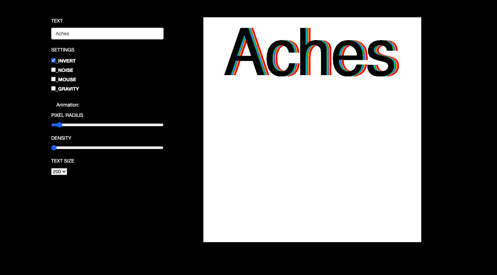

# JavaScript-Text-Generator

# Getting Started

To run this project on local host, Clone (or download) the repository:

Git clone https://github.com/chriskeaveney/JavaScript-Text-Generator.git

Place the project folder in your computers htdocs folder

Download and run XAMP server on your PC (or MAMP for mac computers)

Open the 'TypographyApp' folder on localhost

This app allows the user to alter the canvas text using generative design from several inputs.

The origional text design was inspired from a street artist 'Aches' from Dublin City. Much
of his work involves this 3d colour effect.

